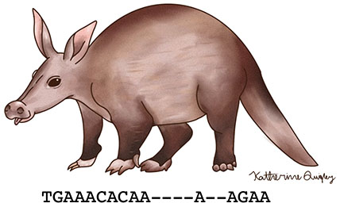
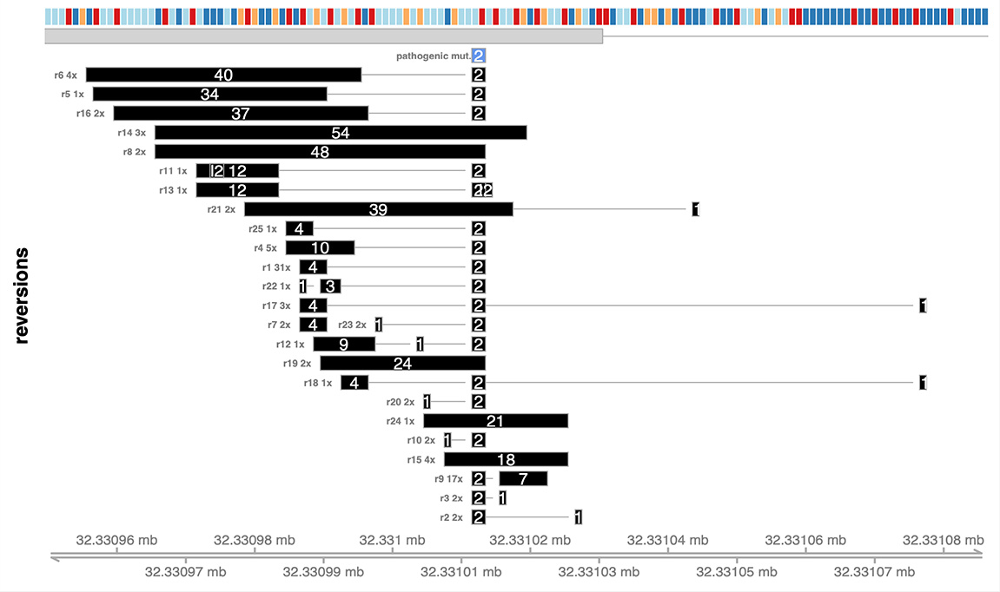
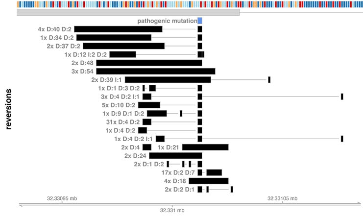

# AARDVARK

**An Automated Reversion Detector for Variants Affecting Resistance Kinetics**

<br />

AARDVARK is an R package that identifies reversion mutations in DNA sequence data. For 
motivation, you could read our 2017 paper [Quigley et al. Cancer Discovery 2017](https://pubmed.ncbi.nlm.nih.gov/28450426/) where we demonstrated that a common form of PARP inhibitor resistance, called reversion mutations, can be detected in advanced prostate cancer by liquid biopsy.

AARDVARK was developed in the [Quigley lab](https://quigleylab.ucsf.edu) at UCSF.

## Installation and dependencies

AARDVARK is an R package and can be installed in the usual way from source:

```
install.packages("aardvark_0.2.7.tar.gz", repos=NULL, type="source")
```

The AARDVARK package is dependent on the following R packages, all of which are available through 
CRAN or Bioconductor:

GenomicRanges, VariantAnnotation, GenomicAlignments, Rsamtools, Biostrings, stringr, 
IRanges, BSgenome.Hsapiens.UCSC.hg38, BSgenome.Hsapiens.UCSC.hg19, biomaRt, ensembldb, 
testthat, EnsDb.Hsapiens.v86, Gviz

In typical use cases, you define define one or more pathogenic mutations in a VCF 
file and all sequencing reads in a window around that region are automatically read from a BAM file. 

**AARDVARK ships with command-line scripts that allow users to use AARDVARK without writing any R code.**


## Running AARDVARK from the command line

This script loads in the reads from an aligned and indexed bam file bam_input.bam and realigns any reads that fall within a 3000 base window centered around any variant described in the VCF file. The BAM must be aligned and indexed, and the reference must match the genome draft you specify. Using this approach, any number of alleles could be tested.

**IMPORTANT**: Running this program does *not* create a new BAM file or in any way modify the BAM you are using; the realigned reads are used to generate a report that will be written to the output folder.

```
Rscript realign_BAM_region_from_VCF.R \
  --sample_id test \
  --fn_bam bam_input.bam \
  --window_size 3000 \
  --genome_draft 38 \
  --fn_vcf /path/to/vcf/with/candidate/pathogenic/alleles.vcf \
  --dir_out /path/to/output

```

### Where to find the command line scripts

The realign_BAM_region_from_VCF.R file can be found in the */exec* folder under wherever R installs aardvark. To find it on your installation, use the built-in *.libPaths()* function in R. 

On my current build *.libPaths()* returns  
*/opt/R/4.1.2/lib/R/library*  
so on my installation the *realign_BAM_region_from_VCF.R* script is at  
*/opt/R/4.1.2/lib/R/library/aardvark/exec/realign_BAM_region_from_VCF.R*

## Example data and reproducing results

To try out AARDVARK on a real BAM file, you can [download a small segment of an indexed BAM file and paired VCF](https://doi.org/10.5281/zenodo.7860648) that is suitable for AARDVARK. Note that this BAM file only includes a tiny piece of sequence surrounding the pathogenic mutation on *BRCA2* and cannot be used to reconstruct anything else about the genome from this person.

The following code will identify reversion mutations in this file. If you are running this locally, replace the value of DIR_EXAMPLE with a folder on your own computer and the value of DIR_LIBRARY with the location where aardvark was installed on your computer. See the above section (Where to find the command line scripts) to set the value for DIR_LIBRARY.

```
DIR_LIBRARY="/notebook/code"
DIR_EXAMPLE="/notebook/human_prostate_AARDVARK/example"

cd $DIR_EXAMPLE
wget https://zenodo.org/record/7860648/files/aardvark_example.tar.gz
tar -xzf aardvark_example.tar.gz 

Rscript ${DIR_LIBRARY}/aardvark/exec/realign_BAM_region_from_VCF.R \
   --sample_id example \
   --fn_bam ${DIR_EXAMPLE}/aardvark_example.bam \
   --fn_vcf ${DIR_EXAMPLE}/aardvark_example.vcf \
   --window_size 4000 \
   --genome_draft 38 \
   --dir_out ${DIR_EXAMPLE}

Rscript ${DIR_LIBRARY}/aardvark/exec/draw_reversion_summary.R \
  --fn_summary ${DIR_EXAMPLE}/example_chr13_32331011_AARDVARK_reversion_summary_with_reads.txt  \
  --genome_draft 38 \
  --pos_start 32330950 \
  --pos_end 32331087 \
  --fig_height=6 \
  --fig_width=10 \
  --fn_out ${DIR_EXAMPLE}/aardvark_example.pdf
 
```

The call to *draw_reversion_summary.R* generates the following image:




## Running AARDVARK with sequence data within R

This example uses a small amount of real data provided with AARDVARK to demonstrate 

1) defining a pathogenic mutation object
2) re-aligning reads from raw data
3) summarizing and plotting the results

In this example, we know the subject has a four base deletion in *BRCA2*, 
chr13:32339798 ACTAG>A.

Data for this example were obtained from the [SRA project PRJEB29279](https://www.ncbi.nlm.nih.gov/bioproject/PRJEB29279), 
and aligned to reference HG38 using bwa-mem.

```
library( aardvark )
library( BSgenome.Hsapiens.UCSC.hg38 ) # used to plot reversion summaries
library( biomaRt )                     # used to plot reversion summaries

# ------------------------------------------------------------------------------
# Load the data object
# ------------------------------------------------------------------------------
data( ERR2851475 )

# ------------------------------------------------------------------------------
# Define the pathogenic mutation
# ------------------------------------------------------------------------------
path_mut = aardvark::Mutation( chrom="chr13", 
                               pos=32339798, 
                               seq_ref = "ACTAG", 
                               seq_alt = "A",
                               transcript = aardvark::transcript_BRCA2)

# ------------------------------------------------------------------------------
# Define the alignment window
# The alignment window is the region of the genome where AARDVARK will look for 
# sequence to realign the sample. The start and end points can be at any bounds, but 
# the bounds should be larger than the region of reads you're testing to allow
# for reads that, when re-aligned, change their start or end position. A safe 
# distance would be several thousand bases wider than the region of aligned 
# reads from the original alignment.
# ------------------------------------------------------------------------------

helper = aardvark::AlignmentWindow( Hsapiens_version = BSgenome.Hsapiens.UCSC.hg38, 
                                chrom="chr13",
                                window_start = 32320000, 
                                window_end =   32350000)

# ------------------------------------------------------------------------------
# Realign each read 
# ------------------------------------------------------------------------------
reads = vector( mode = "list", length = ERR2851475$N )
for( ctr in 1 : ERR2851475$N ){
	read = aardvark::read_from_BamData( ERR2851475, ctr )
	read = aardvark::realign_read( read,
                                   align_window = helper,
                                   pathogenic_mutation = path_mut)
	reads[[ ctr ]] = aardvark::assess_reversion(read,
                                                transcript = aardvark::transcript_BRCA2,
                                                pathogenic = path_mut,
                                                align_window = helper)
}

# ------------------------------------------------------------------------------
# summarize and plot the results
# ------------------------------------------------------------------------------
read_summary = aardvark::summarize_candidates( reads, transcript, path_mut )

ensembl = biomaRt::useDataset("hsapiens_gene_ensembl", mart = biomaRt::useMart("ensembl") )
aardvark::plot_reversion_summary(read_summary$summary, 
                                 hsapiens_object = BSgenome.Hsapiens.UCSC.hg38::Hsapiens, 
                                 genome_version = 38, 
                                 biomart_object = ensembl, 
                                 pos_start = 32339780, 
                                 pos_end = 32339880)

```

This analysis identifies one reversion mutation isoform, with a 32 nucleotide deletion. 
This isoform represents a reversion because the pathogenic 4 nucleotide deletion 
in combination with the the novel 32 nucleotide deletion sums to 36 nucleotides 
deleted. This is a multiple of 3, so the gene is put back into frame.

The call to plot_reversion_summary() generates the following image:




## How to build an AARDVARK read object from within R

```
library( aardvark )
library( BSgenome.Hsapiens.UCSC.hg38 )

# ------------------------------------------------------------------------------
# define the location and nature of the pathogenic mutation and
# tell AARDVARK where to locally realign
# ------------------------------------------------------------------------------

pathogenic_mut = aardvark::Mutation( chrom="chr13", 
                         pos=32339657, 
                         seq_ref = "CTT", 
                         seq_alt = "C", 
                         transcript=aardvark::transcript_BRCA2)

AW = aardvark::AlignmentWindow( Hsapiens_version = BSgenome.Hsapiens.UCSC.hg38, 
                                chrom="chr13",
                                window_start = pathogenic_mut$pos - 3000, 
                                window_end = pathogenic_mut$pos + 3000)

# ------------------------------------------------------------------------------
# create a read object (can be automated with the read_from_BamData() function )
# Realign the read and show that while the original read has a 72bp soft clip,
# the corrected read has a large deletion flanked by two perfect matches.
# ------------------------------------------------------------------------------

read_nt = "CAGCCTTAGCTTTTTACACAAGTTGTAGTAGAAAAACTTCTGTGAGTCAGACTTCATTACTTGAAGCAAAAAAAAGTTCCTTACACAAAGTTAAGGGAGTGTTAGAGGAATTTGATTTAATCAGAACTGAGCATAGTCTTCACTATTCACC"
read_original = aardvark::Read( qname="A00887:299:HWFYGDSXY:2:2674:25211:28682",
                     cigar = "72S79M",
                     chrom = "chr13",
                     pos = 32340564,
                     seq = DNAString( read_nt ),
                     qual = rep(37, 151) )
                     
print( read_original$cigar_ranges )
read_realigned = aardvark::realign_read( read = read_original, 
                                         align_window = AW, 
                                         pathogenic_mutation = pathogenic_mut )

print( read_realigned$cigar_ranges )

# ------------------------------------------------------------------------------
# Assess the predicted consequences of the realigned read and show the read
# is predicted to produce a reversion that spans the pathogenic variant.
# ------------------------------------------------------------------------------

read_realigned = aardvark::assess_reversion(read = read_realigned,
                           transcript = aardvark::transcript_BRCA2,
                           pathogenic = pathogenic_mut,
                           align_window = AW,  
                           gr_pathogenic =  aardvark::genomicRangesFromMutation(pathogenic_mut) )
                                                    
                                                    
read_summary = aardvark::summarize_candidates( list( read_realigned ), 
                                               transcript=aardvark::transcript_BRCA2,
                                               pathogenic_mutation=pathogenic_mut)
print( read_summary$summary )
```

The read summary will be a data frame containing:

alias|N|reversion|evidence|pos|chrom|transcript_id|pathogenic_mutation
--|--|--|--|--|--|--|--
D:1137:32339427:32340563|1|D:1137:32339427:32340563|reversion_read_deletion_spans_pathogenic_variant|32339427|chr13|ENST00000380152|D:2:32339658:32339659


